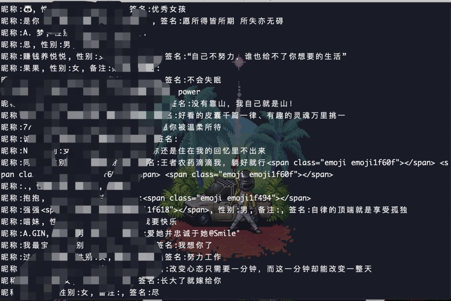

<h2 align="center"><code>🐍Website_login_mode</code></h2>

<br>
<p align="center">
    
</p>

<br>

<p align="center">"<i>Did you know all your doors were locked?</i>" - Riddick (The Chronicles of Riddick)</p>

<br>
<div align="center">
  <sub>Created by
  <a href="https://criselyj.github.io/">CriseLYJ</a>
</div>

<br>

****

# 🌟Website_login_mode
I collected some major website login methods, and some website crawling programs, some are registered through selenium, some are directly simulated login by capturing packets, some are using scrapy, I hope to help Xiaobai, this project is used for research and sharing The simulated landing mode of the big website, and the crawler program, I will continue to update. . .

## Simulate login to some common websites and crawl corresponding information


## About

The basic login is based on direct login or using selenium+webdriver. Some websites are very difficult to log in directly. For example, qq space, bilibili, etc. if you use selenium, it is relatively easy.

Although it is selenium when logging in, for efficiency, we can maintain the cookie obtained after login, and then call requests or scrapy for data collection, so the speed of data collection can be guaranteed.


## Completed

- [x] [Facebook](https://www.facebook.com/)
- [x] [无需身份验证即可抓取Twitter前端API](https://twitter.com/)
- [x] [微博网页版](http://weibo.com)
- [x] [知乎](http://zhihu.com)
- [x] [QQZone](https://qzone.qq.com/)
- [x] [CSDN](https://www.csdn.net/)
- [x] [淘宝](www.taobao.com)
- [x] [Baidu](www.baidu.com)
- [x] [果壳](https://www.guokr.com/)
- [x] [JingDong 模拟登录和自动申请京东试用](https://www.jd.com/)
- [x] [163mail](https://mail.163.com/)
- [x] [拉钩](https://www.lagou.com/)
- [x] [Bilibili](https://www.bilibili.com/)
- [x] [豆瓣](https://www.douban.com/)
- [x] [Baidu2](www.baidu.com)
- [x] [猎聘网](https://www.liepin.com/)
- [x] [微信网页版登录并获取好友列表](https://wx.qq.com/)
- [x] [Github](https://github.com/)
- [x] [爬取图虫相应的图片](https://tuchong.com/)

## show

### Bilibili automatic login test is normal, the success rate is 98%


### web Weichat




### 图虫spider


### TaoBaoweb
- taobao.py为模拟登录
- 剩下的文件为爬虫

### Github


```
1. Climb the sub-labels of Taobao, rank the product information by sales, and save to MongoDB by category.
2. Data analysis by pandas
3. Display the distribution of goods in each province, sales ranking, map distribution, etc. through matplotlib
```

### Guoke.spider use caution, download faster! 10 seconds to download a bunch, screenshots I will not show, has been deleted, too many things 😝

### Sina
- sina.py: Log in for the simulation
- spider: Folder in the crawler

```
1. Enter the blogger ID to crawl and get an ajax request
2. Parse the json data, crawl all the bloggers of the blogger, save to MySQL

```


## tips of pull request 

- Welcome everyone to come pull request 💗

## Problems

- About the verification code: The method used in this project does not process the verification code. The difficulty of identifying the complex verification code is still relatively large at present. In my opinion, the best way to do reptiles is to try to avoid the verification code.
- Code invalidation: Due to website policy or style change, the code is invalid, please give me an issue. If you have already solved it, you can mention PR, thank you!

## Another
- If you have any website that is difficult to log in, such as a website that uses selenium+webdriver and can't log in, please feel free to give me an issue.
- If the repo is helpful to everyone, give a star encouragement.

## something to add

1. After writing the project for a period of time, I found that the style of the code and the ease of use of the program, scalability, and readability of the code all have certain problems, so the next most important thing is to refactor the code so that everyone can It's easier to make some small features of your own.
2. If you feel that the login of a website is very representative, please feel free to ask in the issue
3. If the login to the site is very interesting, I will add it in a later update.
4. The login mechanism of the website may change frequently, so when the current simulated login rule cannot be used, please submit it in the issue.
- If you have a lot of attention, I will continue to maintain this repository to bring more things and refactor the code.

## Acknowledgments
- Thanks for all!

## Written at the end
- I need your support.
- And I think you can give me a 🌟``star``!s