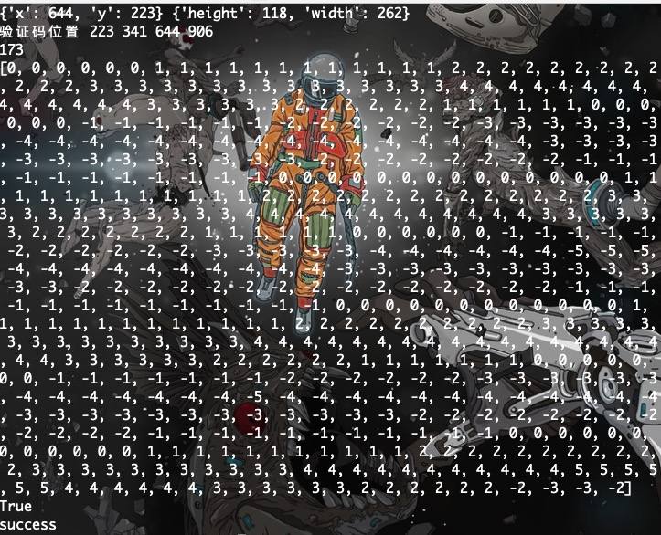
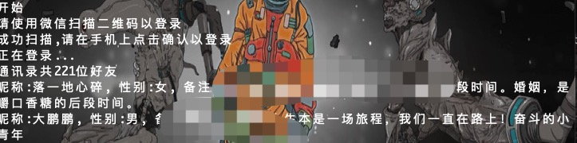
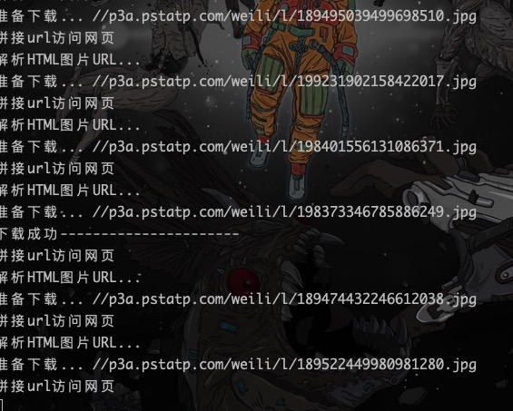
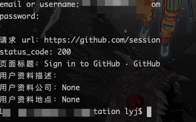

<h2 align="center"><code>🐍Website_login_mode</code></h2>

<br>
<p align="center">
    
</p>

<br>

<p align="center">"<i>Did you know all your doors were locked?</i>" - Riddick (The Chronicles of Riddick)</p>

<br>
<div align="center">
  <sub>Created by
  <a href="https://criselyj.github.io/">CriseLYJ</a>
</div>

<br>

****

# 🌟Website_login_mode
🌟收集了一些各大网站登陆方式， 和一些网站的爬虫程序，有的是通过selenium登录，有的是通过抓包直接模拟登录，有的是利用scrapy,希望对小白有所帮助,本项目用于研究和分享各大网站的模拟登陆方式，和爬虫程序，会持续更新。。。

## 模拟登录一些常见的网站和爬取相应的信息


## About

模拟登陆基本采用的是直接登录或者使用selenium+webdriver的方式，有的网站直接登录难度很大，比如qq空间，bilibili等如果采用selenium就相对轻松一些。

虽然在登录的时候采用的是selenium,为了效率，我们可以在登录过后得到的cookie维护起来，然后调用requests或者scrapy等进行数据采集，这样数据采集的速度可以得到保证。


## Completed

- [x] [Facebook](https://www.facebook.com/)
- [x] [无需身份验证即可抓取Twitter前端API](https://twitter.com/)
- [x] [微博网页版](http://weibo.com)
- [x] [知乎](http://zhihu.com)
- [x] [QQZone](https://qzone.qq.com/)
- [x] [CSDN](https://www.csdn.net/)
- [x] [淘宝](www.taobao.com)
- [x] [Baidu](www.baidu.com)
- [x] [果壳](https://www.guokr.com/)
- [x] [JingDong 模拟登录和自动申请京东试用](https://www.jd.com/)
- [x] [163mail](https://mail.163.com/)
- [x] [拉钩](https://www.lagou.com/)
- [x] [Bilibili](https://www.bilibili.com/)
- [x] [豆瓣](https://www.douban.com/)
- [x] [Baidu2](www.baidu.com)
- [x] [猎聘网](https://www.liepin.com/)
- [x] [微信网页版登录并获取好友列表](https://wx.qq.com/)
- [x] [Github](https://github.com/)
- [x] [爬取图虫相应的图片](https://tuchong.com/)

## show

### Bilibili自动登录测试正常，成功率98%



### web微信




### 图虫爬虫




### 淘宝web
- taobao.py为模拟登录
- 剩下的文件为爬虫

### Github



```
1. 爬取淘宝各子标签，按销量排名商品信息，按分类保存至MongoDB
2. 通过pandas进行数据分析
3 .将商品在各省分布、销量排行、地图分布等通过matplotlib绘图显示
```

### guoke.spider使用需谨慎，下载的比较快！10秒能下载一堆，截图我就不展示了，已经删除,东西太多了😝

### 微博
- sina.py为模拟登录
- spider文件夹中为爬虫

```
1. 输入要爬取的博主ID，获取ajax请求
2. 解析json数据，爬取博主所有微博，保存至MySQL

```


## tips of pull request 

- 欢迎大家一起来 pull request 💗

## Problems

- 关于验证码：本项目所用的方法都没有处理验证码，识别复杂验证码的难度就目前来说，还是比较大的。以我的心得来说，做爬虫最好的方式就是尽量规避验证码。
- 代码失效：由于网站策略或者样式改变，导致代码失效，请给我提issue，如果你已经解决，可以提PR，谢谢！

## Another
- 如果你有什么比较难登陆的网站，比如发现用了selenium+webdriver都还登陆不了的网站，欢迎给我提issue
- 如果该repo对大家有帮助，给个star鼓励鼓励吧

## something to add

1. 项目写了一段时间后，发现代码的风格和程序的易用性，可扩展性，代码的可读性，都存在一定的问题，所以接下来最重要的是重构代码，让大家可以更容易的做出一些自己的小功能。
2. 如果你觉得某个网站的登录很有代表性，欢迎在 issue 中提出
3. 如果网站的登录很有意思，我会在后面的更新中加入
4. 网站的登录机制有可能经常的变动，所以当现在的模拟的登录的规则不能使用的时候，请在 issue 中提出
- 如果关注量大的话，我还是会不断维护此仓库带来更多的东西，并且重构代码，

## Acknowledgments
- Thanks for all!

### 在这里还是要特别感谢V2EX上的所有人！多谢🙏,也感谢从其他地方过来的所有人，感谢🙏

## Written at the end
- I need your support.
- And I think you can give me a 🌟``star``!
